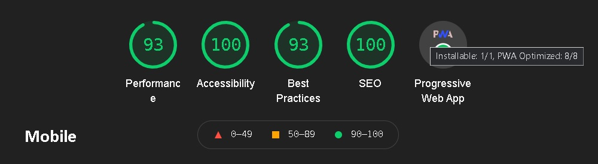

<h1 align="center">Mobile weather app with React</h1>

# Table of Contents

- [Overview](#overview)
- [Tech](#tech)
- [Some of solutions](#some-of-solutions)
- [Demo](#demo)

# Overview

# Tech

- React
  - Hooks
  - Redux
  - Redux-Thunk
- Styled Components
- Service Worker
- Eslint
- Prettier
- Mobile first

# Some of solutions

- reduce api calls(data is stored for an hour)
- remember the list of added cities
- animating elements only after content change
- reduce size of json city list(for search hints)
- parse data from api
  - handle time and timezone
  - convert degrees to compass direction
  - check api calls using regex
- detect and debounces touch actions without using additional packages
- edit city list using redux(apply/decline changes)
- locating the user
- user experience - displaying notifications

# Demo

Check live: [https://binaryworlds.github.io/WeatherApp/](https://binaryworlds.github.io/WeatherApp/)

